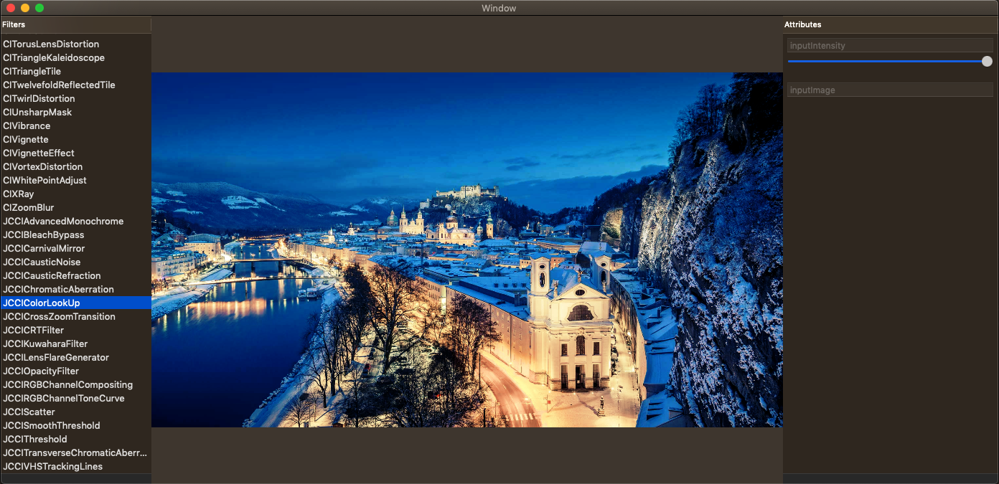
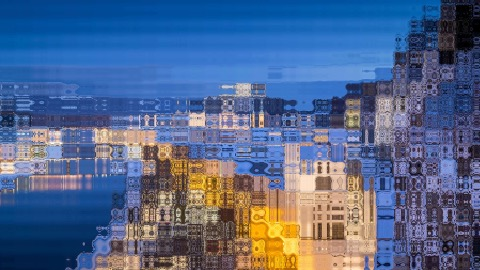
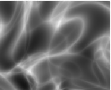
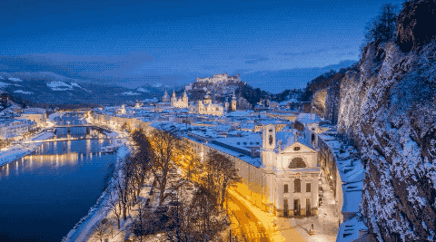
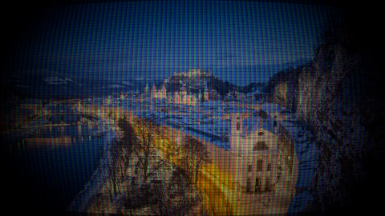

## CoreImage-MetalLibrary

Core Image Filter Explorer. Build for macOS.

## Custom Filters
Mostly base on [*Filterpedia*](https://github.com/FlexMonkey/Filterpedia). Using metallib. Written in Swift.

### Color Look up
#### Amatorka

### Advanced Monochrome

### Bleach Bypass

### Carnival Mirror

### Caustic Noise

### Caustic Refraction

### Chromatic Aberration

### Cross Zoom Transition

### CRT

### Lens Flare Generator

### Scatter

### Smooth Threshold

### Transverse Chromatic Aberration

### VHS Tracking Lines

